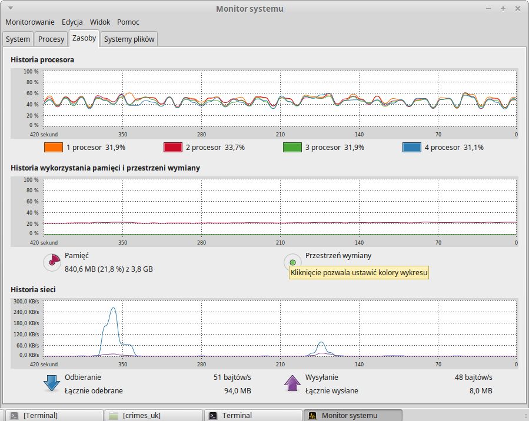
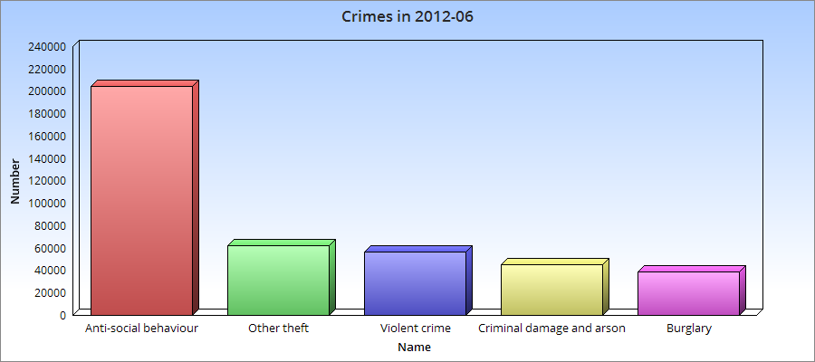
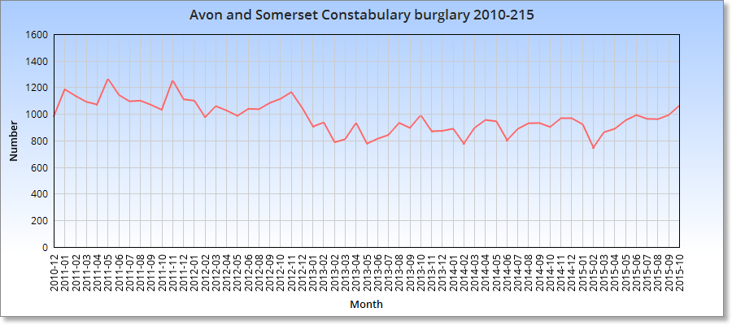
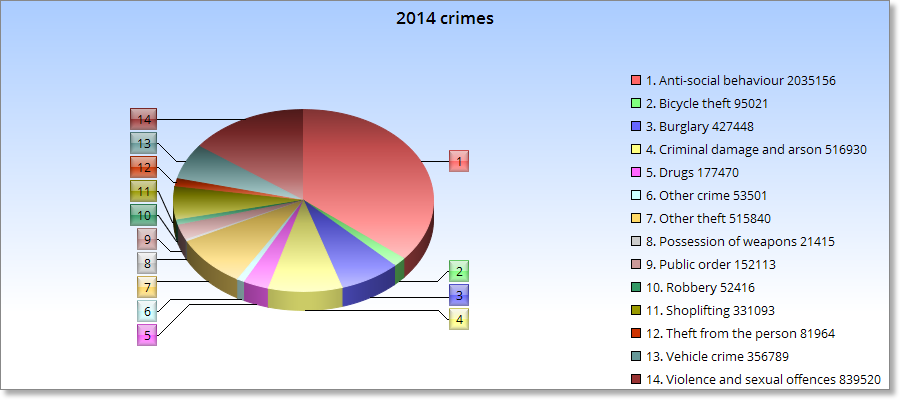
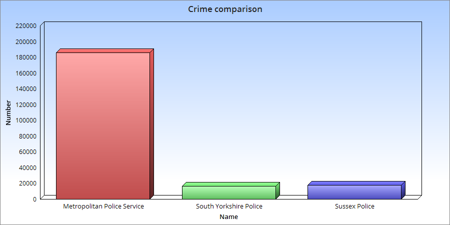
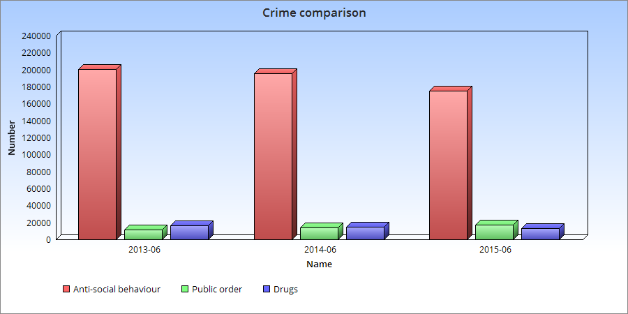

# Aggregation Pipeline      
####Jacek Sikora 206232 <jaresh@wp.pl>
MONGO 3.2.0

#Spis treści
- [Przygotowanie danych](#przygotowanie-danych)

# Przygotowanie danych


[Przestępstwa popełnione w Wilekiej Brytani od grudnia 2010 do października 2015.](https://data.police.uk/data/)

5.7 GB

--
Skrypt [imports.sh](scripts/imports.sh) do importu danych z plików .csv:
```bash

#!/bin/bash

files=(`basename -a *`)

for i in ${files[@]}
do
	../../Programy/mongodb-linux-x86_64-3.2.0/bin/mongoimport -d Crimes -c list --type csv --file $i --headerline
done
```
--
Import plików do bazy:
```bash
time ./imports.sh

real	29m52.893s
user	37m30.754s
sys	5m24.873s

```


--
Najważniejsze statystyki bazy:

```js
db.list.stats()
{
	"ns" : "Crimes.list",
	"count" : 29563143,
	"size" : 14698514832,
	"avgObjSize" : 497
}
```

# Agregacje

## Agregacja 1

Najczęstsze przestępstwa w czerwcu 2012 roku:

[JavaScript](scripts/aggregation1.js)

```js
db.list.aggregate([
	{ $match: {"Month": "2012-06"} }, 
	{ $group: {_id: "$Crime type", "total": {$sum: 1}} }, 
	{ $sort: {"total": -1} }, { $limit : 5}
]);

```

| Crime type		| count |
|-------------------|-------|
| Anti-social behaviour		| 204751 |
| Other theft  	| 61978 |
| Violent crime 	| 56816 |
| Criminal damage and arson			| 44922 |
| Burglary 	| 38791 |



--

## Agregacja 2

Krzywa ilości dokonanych włamań zgłoszonych przez Avon and Somerset Constabulary w latach 2010-2015:

[JavaScript](scripts/aggregation2.js)

```js
db.list.aggregate([
	{ $match: {"Reported by": "Avon and Somerset Constabulary"} },
	{ $match: {"Crime type": "Burglary"} },
	{ $group: {_id: "$Month", "total": {$sum: 1}} }, 
	{ $sort: {"_id": -1} }
]);
```

Wynik


--
## Agregacja 3

Rozkład przestępstw w 2014 roku:

[JavaScript](scripts/aggregation3.js)

```js
db.list.aggregate([
	{ $match: {"Month": { $regex: '2014-[0-9][0-9]', $options: 'g' }} },
	{ $match: {
		$or: [
			{"Crime type":"Anti-social behaviour"},
			{"Crime type":"Other crime"},
			{"Crime type":"Burglary"},
			{"Crime type":"Vehicle crime"},
			{"Crime type":"Robbery"},
			{"Crime type":"Violent crime"},
			{"Crime type":"Other theft"},
			{"Crime type":"Criminal damage and arson"},
			{"Crime type":"Shoplifting"},
			{"Crime type":"Drugs"},
			{"Crime type":"Public disorder and weapons"},
			{"Crime type":"Violence and sexual offences"},
			{"Crime type":"Public order"},
			{"Crime type":"Theft from the person"},
			{"Crime type":"Possession of weapons"},
			{"Crime type":"Bicycle theft"}
		]}
	},
	{ $group: {_id: "$Crime type", "total": {$sum: 1}} }, 
	{ $sort: {"_id": -1} }
]);

```

Wynik

| Crime type		| count |
|-------------------|-------|
|Anti-social behaviour|2035156|
|Bicycle theft|95021|
|Burglary|427448|
|Criminal damage and arson|516930|
|Drugs|177470|
|Other crime|53501|
|Other theft|515840|
|Possession of weapons|21415|
|Public order|152113|
|Robbery|52416|
|Shoplifting|331093|
|Theft from the person|81964|
|Vehicle crime|356789|
|Violence and sexual offences|839520|



## Agregacja 4

Porównanie przestępstw narkotykowych w 3 wybranych rejonach:

[JavaScript](scripts/aggregation4.js)

```js
db.list.aggregate([
	{ $match: {
		$or: [
			{"Reported by": "Sussex Police"},
			{"Reported by": "South Yorkshire Police"},
			{"Reported by": "Metropolitan Police Service"}
		],
		$and: [
			{"Crime type": "Drugs"}
		]}
	},
	{ $group: {_id: "$Reported by", "total": {$sum: 1}} },
	{ $sort: {"_id": -1} }
]);

```

Wynik

| Region name		| count |
|-------------------|-------|
| Metropolitan Police Service		| 185776 |
| South Yorkshire Police  	| 16285 |
| Sussex Police 	| 17736 |



## Agregacja 5

Rozkład 3 przestępstw w czerwcu w latach 2013-2015:

[JavaScript](scripts/aggregation5.js)

```js
db.list.aggregate([
	{ $match: {
		$or:[
			{"Month": "2013-06"},
			{"Month": "2014-06"},
			{"Month": "2015-06"}
		]}	
	},
	{ $match: {
		$or:[
			{"Crime type":"Anti-social behaviour"},
			{"Crime type":"Drugs"},
			{"Crime type":"Public order"}
		]}
	},
	{ $group: {_id: {month: "$Month", crime: "$Crime type"},
 				total: {$sum: 1}
				}
	},
	{ $group: {_id: "$_id.month",
				crimes: {$addToSet: {crime: "$_id.crime" , total:"$total"}}
			}
	},
	{ $sort: {crime: -1} }
]);

```

Wynik

```js
{
			"_id" : "2015-06",
			"crimes" : [
				{
					"crime" : "Anti-social behaviour",
					"total" : 175226
				},
				{
					"crime" : "Public order",
					"total" : 17642
				},
				{
					"crime" : "Drugs",
					"total" : 12929
				}
			]
		},
		{
			"_id" : "2014-06",
			"crimes" : [
				{
					"crime" : "Drugs",
					"total" : 15135
				},
				{
					"crime" : "Anti-social behaviour",
					"total" : 195760
				},
				{
					"crime" : "Public order",
					"total" : 13682
				}
			]
		},
		{
			"_id" : "2013-06",
			"crimes" : [
				{
					"crime" : "Drugs",
					"total" : 16685
				},
				{
					"crime" : "Anti-social behaviour",
					"total" : 200337
				},
				{
					"crime" : "Public order",
					"total" : 11624
				}
			]
		}
```

| Month	| Anti-social behaviour | Public order | Drugs |
|-------------------|-------|-------|---------|
| 2013-06	| 200337 | 11624 | 16685 |
| 2014-06  	| 195760 | 13682 | 15135 |
| 2015-06 	| 175226 | 17642 | 12929 |



