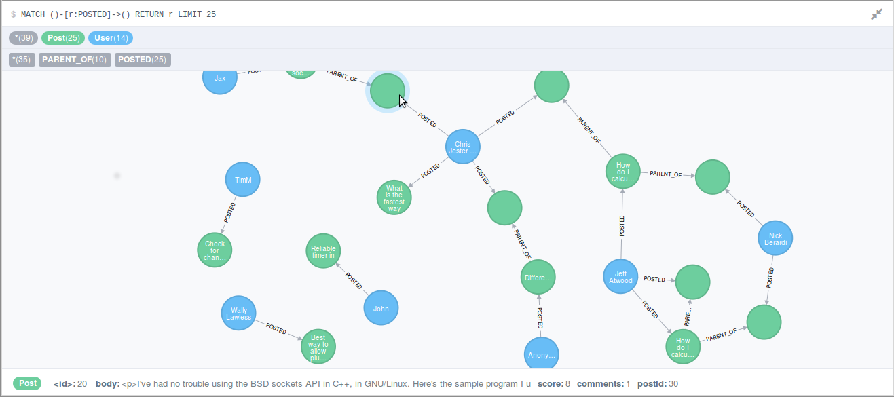
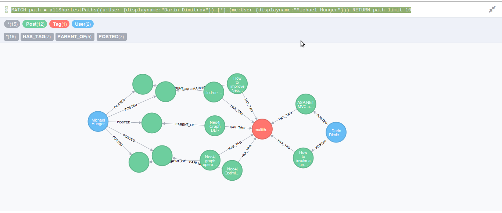
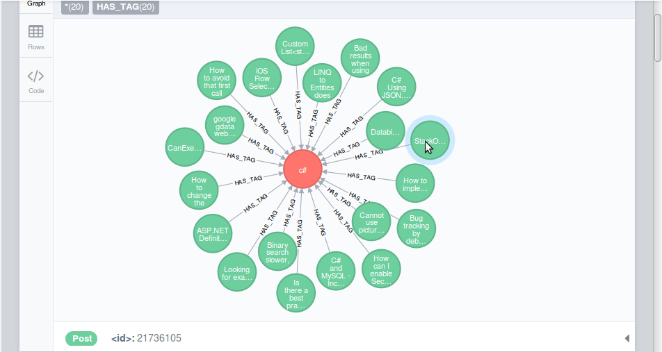
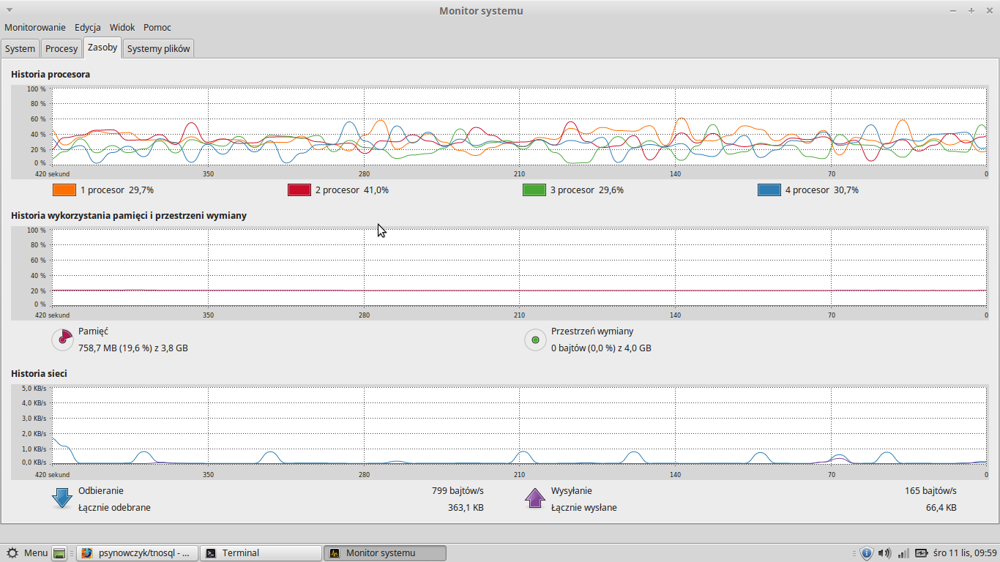
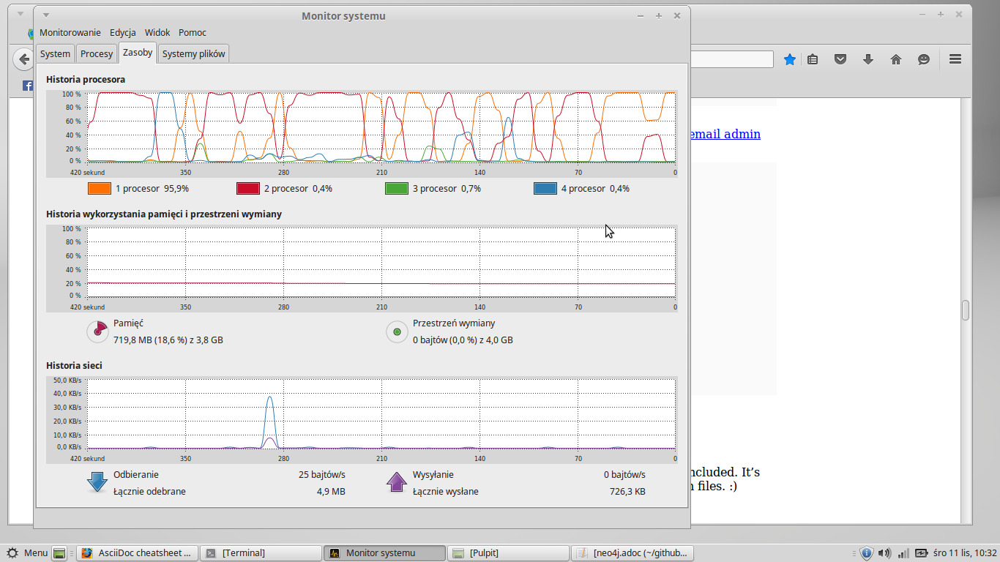
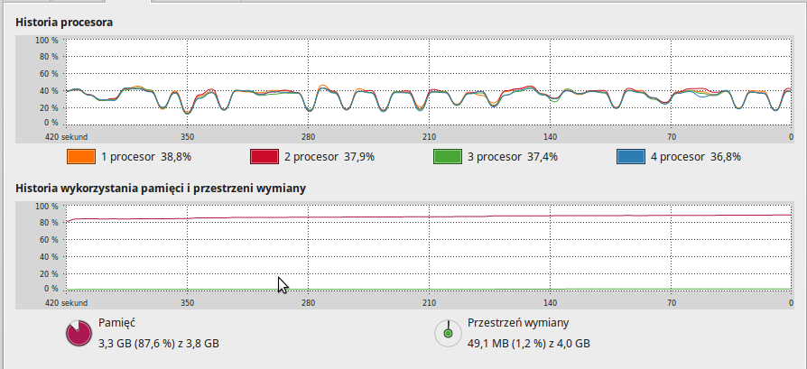

# Neo4j        
####Jacek Sikora <jaresh@wp.pl>

#Spis treści
- [Analiza danych](#analiza-danych)
- [Neo4j Spatial](#neo4j-spatial) - geolokalizacja
- [Pobranie danych](#pobranie-danych)
- [Przygotowanie danych](#przygotowanie-danych)

#Analiza danych

Ilość rekordów w bazie:
```
neo4j-sh (?)$ match (n) return head(labels(n)) as label, count(*);
```


--

Dodanie indeksów:

```
create index on :Post(title);
create index on :Post(views);
create index on :Post(score);

create index on :User(displayname);
create index on :User(views);

create constraint on (t:Tag) assert t.tagId is unique;
create constraint on (u:User) assert u.userId is unique;
create constraint on (p:Post) assert p.postId is unique;
```
--

10 najaktywniejszych użytkowników

```
match (u:User) 
with u,size( (u)-[:POSTED]->()) as posts order by posts desc limit 10 
return u.name, posts;
```

| Name		| Posts |
|-------------------|-------|
| Jon Skeet 		| 30043 |
| Gordon Linoff  	| 20612 |
| Darin Dimitrov 	| 15854 |
| BalusC 			| 14256 |
| CommonsWare 	| 13754 |
| anubhava 		| 13576 |
| Hans Passant 	| 13349 |
| Martijn Pieters | 12995 |
| SLaks  			| 11386 |
| Marc Gravell	| 11055 |

10 rows
269295 ms

--

Tagi występujące razem z tagiem "javascript"

```
match (t:Tag {tagId:"javascript"})<-[:HAS_TAG]-()-[:HAS_TAG]->(other:Tag) 
WITH other, count(*) as freq order by freq desc limit 5
RETURN other.tagId,freq;
```
| Tag | freq   |
|-------------|--------|
| jquery    | 243932 |
| html      | 119933 |
| css       | 54170  |
| php      | 50525  |
| ajax      | 39734  |

5 rows
209501 ms

--

Posty 25 uzytkowników:

```
MATCH ()-[r:POSTED]->() RETURN r LIMIT 25
```



--
Top 5 tagów użytych przez użytkownika "Jon Skeet" w odpowiedziach:

```
match (u:User)-[:POSTED]->()-[:HAS_TAG]->(t:Tag) 
where u.displayname = "Jon Skeet" 
return t.tagId,count(*) as posts order by posts desc limit 5;
```
| Tag    | posts |
|------------|-------|
| c#      | 11    |
| .net     | 7     |
| c#-4.0   | 5     |
| .net-4.0 | 4     |
| com      | 3     |

5 rows
93 ms

--
Jak połączeni są użytkownicy "Darin dimitrov" z "Michael Hunger":

```
MATCH path = allShortestPaths(
     (u:User {displayname:"Darin Dimitrov"})-[*]-(me:User {displayname:"Michael Hunger"}))
RETURN path limit 10
```



--

Najczęściej odpowiadajacy użytkownicy i ich aktywność w tematyce:

```
MATCH (neo:Tag {tagId:"neo4j"})<-[:HAS_TAG]-()-[:PARENT_OF]->()<-[:POSTED]-(u:User) 
WITH neo,u, count(*) as freq order by freq desc limit 10

MATCH (u)-[:POSTED]->()<-[:PARENT_OF]-(p)-[:HAS_TAG]->(other:Tag)
WHERE NOT (p)-[:HAS_TAG]->(neo)
WITH u,other,count(*) as freq2 order by freq2 desc 
RETURN u.displayname,collect(distinct other.tagId)[1..5] as tags;
```

| Name       | tags                                                     |
|---------------------|----------------------------------------------------------|
| Luanne            | jersey,cypher,jaxb                               |
| Wes Freeman       | go,node.js,java,php                            |
| Mattias Persson   | []                                                       |
| Peter Neubauer   | nosql,graph,java,graph-databases              |
| Michael Hunger    | nosql,spring-data-neo4j,graph-databases,cypher |
| tstorms           | spring-data-neo4j,spring,jini,compare        |
| ulkas             | sql,mysql,jquery,arrays                       |
| Stefan Armbruster | groovy,intellij-idea,tomcat,grails-plugin      |
| Nicholas          | android,eclipse,arrays,algorithm              |
| jjaderberg       | jena,osx-lion,py2app,java                     |


10 rows
161 ms

--

20 postów z tagami "c#":

```
MATCH (node:Tag {tagId:'c#'})<-[:HAS_TAG]-(node1:Post)
RETURN node,node1 LIMIT 20;

20 rows 
64 ms
```




#Neo4j Spatial

Dane to 45387 polskie miasta.

--
#Pobranie danych

[Stack Overflow dump files](https://archive.org/details/stackexchange)

[MAX MIND](http://dev.maxmind.com/geoip/legacy/geolite/) - Lokalizacje miejscowosci na całym świecie 


## Przygotowanie danych

Wypakowanie archiwów 7zip:

```bash
time for i in *.7z; do 7za -y -oextracted x $i; done

Size:       937938638
Compressed: 105420265

real	21m53.298s
user	23m13.552s
sys		0m38.260s
```



31.6 GB danych

--

Ściągamy skrypt do przetwarzenia danych do .csv i instalujemy brakujące paczki : 

```bash
git clone https://github.com/mdamien/stackoverflow-neo4j

sudo apt-get install python3-setuptools
easy_install3 xmltodict
```
--
Uruchamiamy skrypt który stworzy nam pliki csv wraz z relacjami:

```bash
python3 to_csv.py extracted

real	73m45.879s
user	71m49.554s
sys	  0m30.015s
```



4.2 GB danych

--
Import danych do bazy Neo4j:

```bash
./../../Programy/neo4j-community-2.3.0/bin/neo4j-import \
--into ../../Programy/neo4j-community-2.3.0/data/graph.db \
--id-type string \
--nodes:Post "csvs/posts.csv" \
--nodes:User "csvs/users.csv" \
--nodes:Tag "csvs/tags.csv" \
--relationships:PARENT_OF "csvs/posts_rel.csv" \
--relationships:HAS_TAG "csvs/tags_posts_rel.csv" \
--relationships:POSTED "csvs/users_posts_rel.csv"

IMPORT DONE in 26m 41s 500ms. 
Imported:
25247894 nodes
58817742 relationships
126491554 properties
```



Jezeli podczas importu otrzymasz bład dotyczący braku pamieci to należy dodać do pliku 'neo4j-community-2.3.0/bin/neo4j-import', gdzieś przed wywołaniem ostatniego polecenia (wartości -Xms -Xmx zależnie od dostepnej pamięci):

```bash
JAVA_OPTS="-Xms2048m -Xmx2048m"
```
--

#Neo4j Spatial przygotowanie danych

--
Po pobraniu współrzednych miast obrabiam plik aby pozostały tylko polskie miasta.


Import danych do bazy z konsoli Neo4j:

```
LOAD CSV WITH HEADERS FROM "file:/home/jacek/nosql_dane/GeoLiteCity-LocationPL.csv" AS csvLine
CREATE (c:City { name: csvLine.city, lat: toFloat(csvLine.latitude), lon: toFloat(csvLine.longitude) });

```

--

Inicjalizacja warstwy i dodanie indeksu:

```
:POST /db/data/ext/SpatialPlugin/graphdb/addSimplePointLayer

{ 
    "layer" : "geom", 
    "lat" : "lat", 
    "lon" : "lon" 
}

:POST /db/data/index/node/ 

{ 
    "name" : "geom", 
    "config" : { 
        "provider" : "spatial", 
        "geometry_type" : "point", 
        "lat" : "lat", 
        "lon" : "lon" 
    } 
}
```

--

Dodanie indeksow do miast:

```
MATCH (n:City) where not has(n.id) set n.id = id(n) return id(n) as id
```

--

Podłaczenie danych do indeksów 'Spacial':

skrypt "add_spacial.sh":

```
#!/bin/bash
for i in `seq 0 45386`;
do
      curl -i -H "Accept: application/json" -H Content-Type:lication/json -X POST -v http://localhost:7474/db/data/ext/SpatialPlugin/graphdb/addNodeToLayer -d "{ \"layer\": \"geom\",\"node\": \"http://localhost:7474/db/data/node/$i\"}"

done
```


