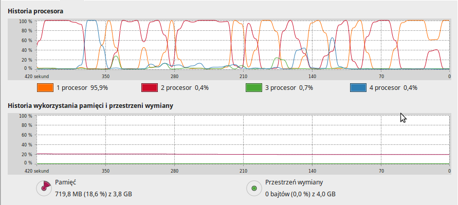
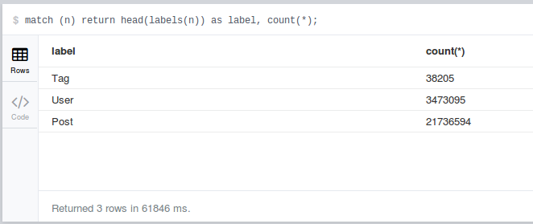

# Neo4j        
####Jacek Sikora <jaresh@wp.pl>


## Pobranie danych

[Stack Overflow dump files](https://archive.org/details/stackexchange)

## Przygotowanie danych

Wypakowanie archiwów 7zip:

```bash
time for i in *.7z; do 7za -y -oextracted x $i; done

Size:       937938638
Compressed: 105420265

real	21m53.298s
user	23m13.552s
sys		0m38.260s
```


31.6 GB danych

--

Ściągamy skrypt do przetwarzenia danych do .csv i instalujemy brakujące paczki : 

```bash
git clone https://github.com/mdamien/stackoverflow-neo4j

sudo apt-get install python3-setuptools
easy_install3 xmltodict
```
--
Uruchamiamy skrypt który stworzy nam pliki csv wraz z relacjami:

```bash
python3 to_csv.py extracted

real	73m45.879s
user	71m49.554s
sys	  0m30.015s
```



4.2 GB danych

--
Import danych do bazy Neo4j:

```bash

./../../Programy/neo4j-community-2.3.0/bin/neo4j-import \
--into ../../Programy/neo4j-community-2.3.0/data/graph.db \
--id-type string \
--nodes:Post "csvs/posts.csv" \
--nodes:User "csvs/users.csv" \
--nodes:Tag "csvs/tags.csv" \
--relationships:PARENT_OF "csvs/posts_rel.csv" \
--relationships:HAS_TAG "csvs/tags_posts_rel.csv" \
--relationships:POSTED "csvs/users_posts_rel.csv"

```
```
IMPORT DONE in 26m 41s 500ms. 
Imported:
25247894 nodes
58817742 relationships
126491554 properties
```


Jezeli podczas importu otrzymasz bład dotyczący braku pamieci to należy dodać do pliku 'neo4j-community-2.3.0/bin/neo4j-import', gdzieś przed wywołaniem ostatniego polecenia (wartości -Xms -Xmx zależnie od dostepnej pamięci):

```bash
JAVA_OPTS="-Xms2048m -Xmx2048m"
```

## Analiza danych

Ilość rekordów w bazie:
```
neo4j-sh (?)$ match (n) return head(labels(n)) as label, count(*);
```



--

Dodanie indeksów:

```
create index on :Post(title);
create index on :Post(createdAt);
create index on :Post(score);
create index on :Post(views);
create index on :Post(favorites);
create index on :Post(answers);
create index on :Post(score);

create index on :User(name);
create index on :User(createdAt);
create index on :User(reputation);
create index on :User(age);

create index on :Tag(count);

create constraint on (t:Tag) assert t.tagId is unique;
create constraint on (u:User) assert u.userId is unique;
create constraint on (p:Post) assert p.postId is unique;
```
--

10 najaktywniejszych użytkowników

```
match (u:User) 
with u,size( (u)-[:POSTED]->()) as posts order by posts desc limit 10 
return u.name, posts;

+---------------------------+
| u.name 			| posts |
+---------------------------+
| "Jon Skeet"  		| 30043 |
| "Gordon Linoff"  	| 20612 |
| "Darin Dimitrov" 	| 15854 |
| "BalusC" 			| 14256 |
| "CommonsWare" 	| 13754 |
| "anubhava" 		| 13576 |
| "Hans Passant" 	| 13349 |
| "Martijn Pieters" | 12995 |
| "SLaks"  			| 11386 |
| "Marc Gravell" 	| 11055 |
+---------------------------+
10 rows
269295 ms


```

--

Tagi występujące razem z tagiem "javascript"

```
match (t:Tag {tagId:"javascript"})<-[:HAS_TAG]-()-[:HAS_TAG]->(other:Tag) 
WITH other, count(*) as freq order by freq desc limit 5
RETURN other.tagId,freq;

+----------------------+
| other.tagId | freq   |
+----------------------+
| "jquery"    | 243932 |
| "html"      | 119933 |
| "css"       | 54170  |
| "php"       | 50525  |
| "ajax"      | 39734  |
+----------------------+
5 rows
209501 ms


```

--

Posty pierwszych 25 uzytkowników

```
MATCH ()-[r:POSTED]->() RETURN r LIMIT 25

```


